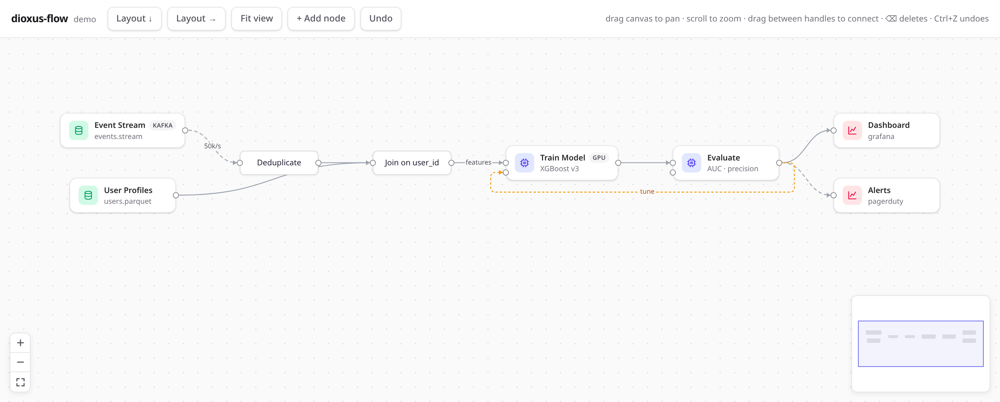

# dioxus-flow

[](https://github.com/XiangpengHao/dioxus-flow/actions/workflows/ci.yml)

A node graph library for [Dioxus](https://dioxuslabs.com), inspired by
[react-flow](https://reactflow.dev). You get a pannable, zoomable canvas with
draggable nodes, connectable handles, animated edges, and automatic layout —
and you can render nodes and edges with your own components.



*The demo app: custom card nodes, edge labels, an animated edge, a custom-styled
edge, auto layout, minimap, and controls. Run it with `cd demo && dx serve`.*

## Features

- **Interactive canvas** — drag to pan, scroll to zoom, click or shift-click
  to select, drag several nodes at once, press Delete to remove.
- **Connections** — drag from one handle to another to create an edge. The
  preview line snaps to nearby handles.
- **Edges** — bezier, straight, or smooth-step. Add labels, arrowheads at
  either end, and an `animated` marching-dashes mode.
- **Seat anchoring** — `Flow { anchor: AnchorMode::Seats }` packs edge
  endpoints into discrete seats around each node's rounded rim (deterministic,
  crossing-free where possible), drawn with rim-aware curves and beads. The
  solver is also usable headlessly via the `ports` module.
- **Auto layout** — a built-in layered layout engine, in any of four
  directions. Nodes and the viewport animate smoothly to their new places.
- **Custom everything** — render node content with any Dioxus component
  (Tailwind works great), place handles anywhere, or draw your own edge SVG.
- **Batteries included** — `Background`, `Controls`, and `MiniMap` overlays,
  plus `use_flow()` to build your own.
- **Keyboard & accessibility** — nodes are focusable and movable with arrow
  keys, with ARIA labels and `prefers-reduced-motion` support.
- **Fast** — careful reactive scoping keeps pan, zoom, and drag at 60fps with
  1000 nodes (release build).
- **Dark mode** out of the box, themable with CSS variables.

## Quickstart

```rust
use dioxus::prelude::*;
use dioxus_flow::prelude::*;

#[component]
fn App() -> Element {
    let nodes = use_signal(|| vec![
        Node::new("1", "Source", (0.0, 0.0)).node_type("input"),
        Node::new("2", "Transform", (0.0, 130.0)),
        Node::new("3", "Sink", (0.0, 260.0)).node_type("output"),
    ]);
    let edges = use_signal(|| vec![
        Edge::new("1", "2").animated(true),
        Edge::new("2", "3").label("rows"),
    ]);

    rsx! {
        div { style: "width: 100vw; height: 100vh;",
            Flow { nodes, edges, fit_view: true,
                Background {}
                Controls {}
                MiniMap {}
            }
        }
    }
}
```

The `Flow` fills its parent, so give the parent a size. Nodes and edges are
plain signals that you own: the flow updates them when the user drags,
connects, or deletes, and you can change them yourself at any time.

## Custom nodes

Pass a `node_view` function to render nodes your way. It receives every node;
match on `node_type` and return any element. Put `Handle`s wherever you want —
edges attach to them.

```rust
Flow {
    nodes, edges,
    node_view: move |ctx: NodeViewCtx<MyData>| match ctx.node.node_type.as_deref() {
        Some("card") => rsx! {
            div { class: "rounded-xl border bg-white px-4 py-2 shadow-sm",
                class: if ctx.node.selected { "ring-2 ring-indigo-500" },
                Handle { kind: HandleKind::Target, position: ctx.node.target_side }
                strong { "{ctx.node.label}" }
                p { class: "text-xs text-zinc-500", "{ctx.node.data.subtitle}" }
                Handle { kind: HandleKind::Source, position: ctx.node.source_side }
            }
        },
        _ => rsx! { DefaultNodeView::<MyData> { ctx } },
    },
}
```

`Node<T>` is generic over your own data (`Node<()>` by default); build one
with `Node::with_data(id, label, pos, data)`. A node can have several handles:
give each an `id` and an `offset`, and point at them from
`Edge::source_handle` / `Edge::target_handle`.

## Custom edges

Most styling needs no custom view — use the builder:

```rust
Edge::new("a", "b")
    .kind(EdgeKind::SmoothStep)
    .label("tune")
    .style("stroke: #f59e0b; stroke-dasharray: 4 3;")
    .marker_end(MarkerKind::None)
```

For full control, pass an `edge_view` function. You get the resolved anchor
points and the default path, so you can restyle without redoing the math:

```rust
Flow {
    nodes, edges,
    edge_view: move |ctx: EdgeViewCtx| rsx! {
        path { d: "{ctx.path.d}", stroke: "url(#my-gradient)", fill: "none" }
    },
}
```

## Auto layout and programmatic control

Create a `FlowHandle` to drive the flow from outside:

```rust
let flow = use_flow_handle::<MyData>();

rsx! {
    button { onclick: move |_| flow.auto_layout(&LayoutOptions::default()), "Layout ↓" }
    button {
        onclick: move |_| flow.auto_layout(
            &LayoutOptions::default().direction(LayoutDirection::LeftToRight),
        ),
        "Layout →"
    }
    button { onclick: move |_| flow.fit_view(400), "Fit" }
    Flow { nodes, edges, handle: flow }
}
```

`auto_layout` animates nodes and the viewport together; any user interaction
cancels the animation cleanly. Inside the flow (custom overlays, nodes,
controls), `use_flow()` gives you the same API: the viewport signal,
`fit_view`, `zoom_by`, `center_on`, coordinate conversion, and node geometry.

## Events

| Prop | Fires when |
| --- | --- |
| `on_connect` | the user completes a connection (if absent, the edge is added for you) |
| `on_connect_start` / `on_connect_end` | a connection drag leaves a handle / ends anywhere — `on_connect_end` carries the release point and `connection: None` for a drop on empty canvas, the hook for creating the node there |
| `is_valid_connection` | (a callback, not an event) your say over which connections may complete; failing targets are never offered as snaps |
| `on_node_drag_start` / `on_node_drag_stop` | a node drag really begins (past `drag_threshold`, the undo-snapshot moment) / ends with final positions (the snap-and-persist moment) |
| `on_delete` | Delete/Backspace with a selection (if absent, it's deleted for you) — call `flow.delete_selected()` to proceed, e.g. after saving an undo snapshot |
| `on_node_click` / `on_edge_click` | pointer down on a node / edge |
| `on_pane_click` | click on empty canvas (in flow coordinates) |

## Theming

Override the CSS variables on `.dioxus-flow` or any ancestor:

```css
.dioxus-flow {
  --df-accent: #10b981;
  --df-node-bg: #fff;
  --df-edge: #a1a1aa;
  --df-grid: #e4e4e7;
  /* see dioxus-flow/src/style.css for the full list */
}
```

Dark mode follows `prefers-color-scheme` automatically.

## Development

The repo is a workspace: `dioxus-flow/` is the library, `demo/` is the demo
app. The Nix flake provides everything (Rust with the wasm target, `dx`,
`tailwindcss`, `wasm-opt`); CI runs fmt, clippy, tests, and a wasm check
through the same flake.

```bash
nix develop                # or direnv
cargo test -p dioxus-flow
cd demo && dx serve        # http://127.0.0.1:8080
```

Two tips:

- For release builds, pass `--debug-symbols false` — the nixpkgs `wasm-opt`
  is newer than the one dx pins and crashes on the debug info dx keeps by
  default: `dx build --release --debug-symbols false`.
- The demo doubles as a performance harness: `?stress=1000` replaces the
  showcase graph with a 1000-node grid for profiling.

## Roadmap

- Box selection, edge reconnection
- Sub-flows / node grouping
- Viewport-culled rendering for very large graphs
